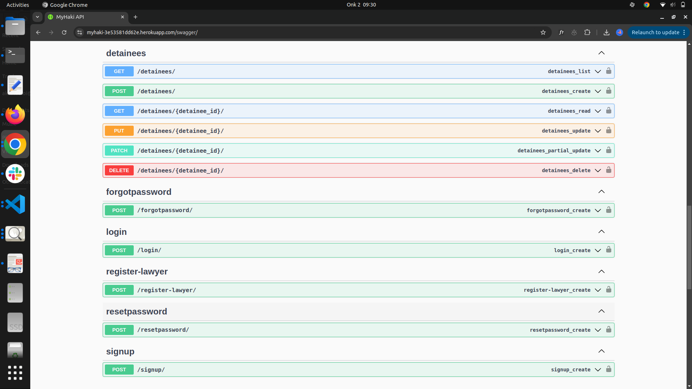
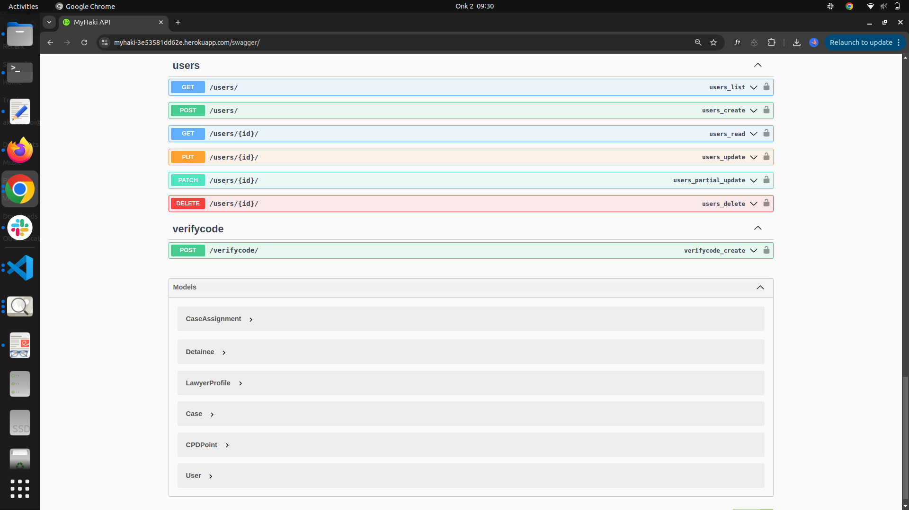
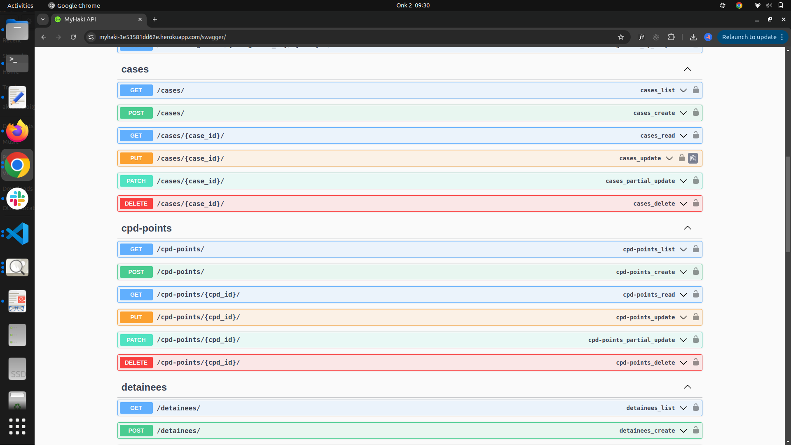
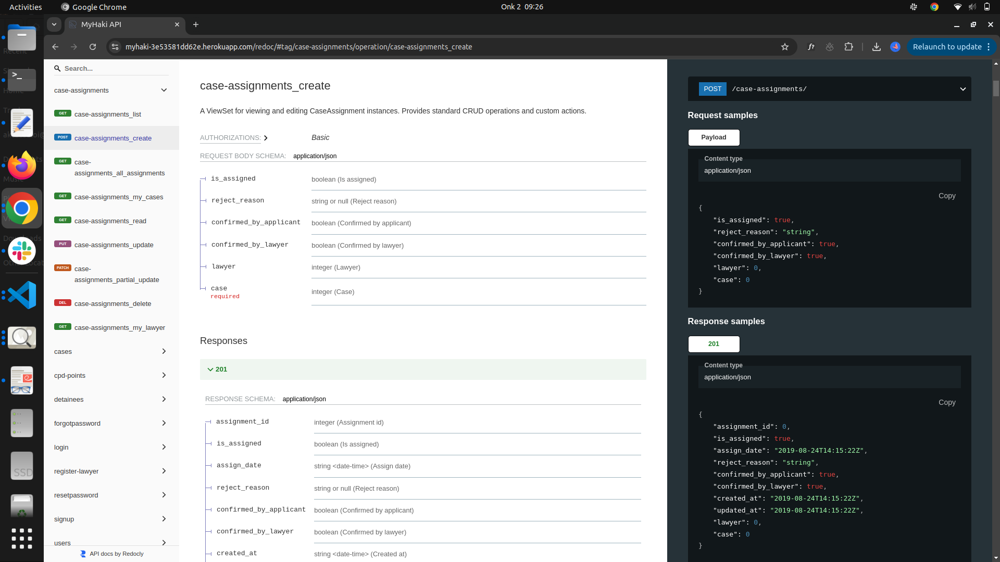
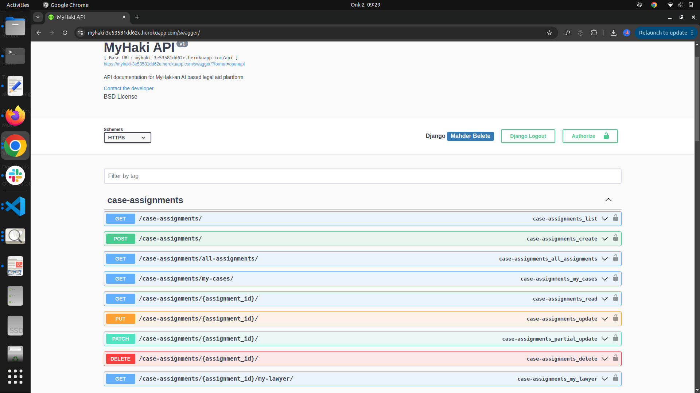
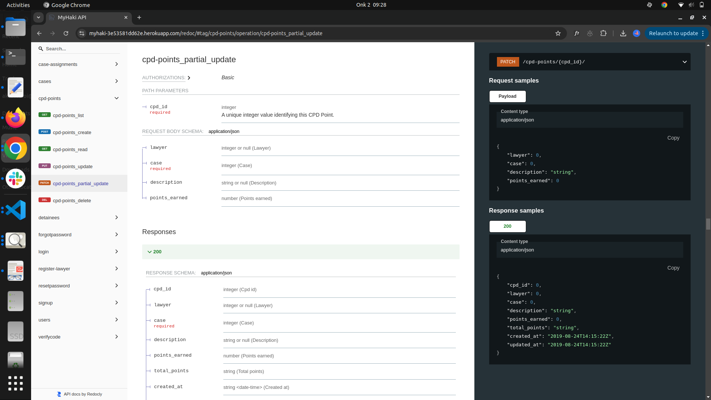
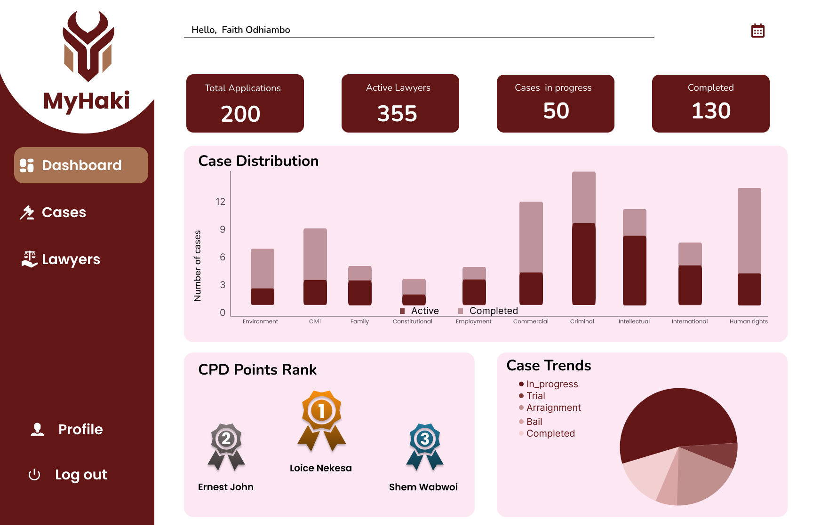
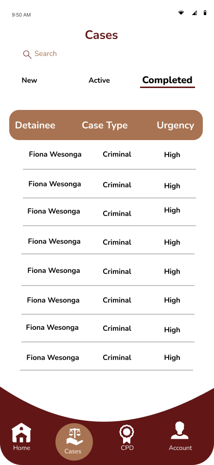
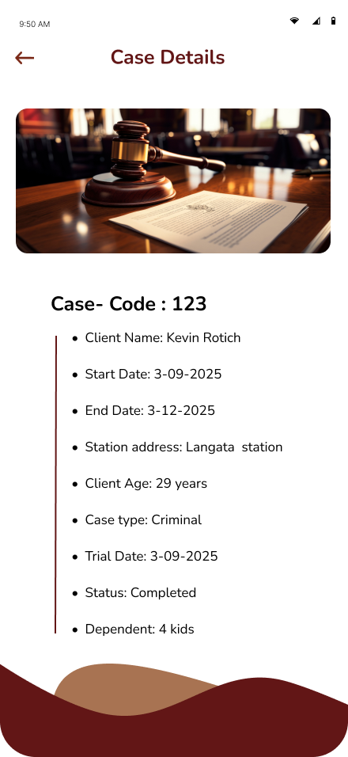

# MyHaki API Reference

Welcome to the **MyHaki API Reference**! Here you’ll find everything needed to integrate, test, and explore the REST endpoints powering MyHaki’s AI-driven legal aid system.

---

## Live API Docs

- **Swagger UI:** [View Swagger Documentation](https://myhaki-3e53581dd62e.herokuapp.com/swagger/)
- **Postman Online Docs:** 

---

## Brand Guidelines Reference

Branding is key for all third-party integrations and admin dashboards. Please use the official assets and styles below:

- **Logo & Marks:**  
    

    

- **Color Palette:**  
  - Deep Red: `#621616`
  - Coffee: `#683929`
  - Light Brown: `#A87352`
  - Pale Pink: `#E5BFA7`
  - Sage Green: `#AABDA9`
  - Mint: `#C7DFC6`
  - Off White: `#DEF6DD`

- **Typography:**  
  - **Font:** Poppins  
  - **Headings:** Poppins Bold  
  - **Subheadings:** Poppins SemiBold  
  - **Body:** Poppins Regular

- **Values:** Justice, Integrity, Accessibility

For full brand guidelines, see [Brand Guideline Screenshot](images/brand-guideline.png).

---

## API Documentation Screenshots

| Swagger UI Example | Postman API Docs Example |
|--------------------|-------------------------|
|  |  |
|  |  |
|  |  |

---

## Main Endpoints

All endpoints are RESTful, return JSON, and require token authentication unless noted.

### Authentication & User Management

<pre class="api-dark">
POST   /register-lawyer/           # Lawyer signup (sets verified)
POST   /signup/                    # Applicant signup
POST   /login/                     # Login, returns authentication token
POST   /logout/                    # Logout (invalidate token)
</pre>

### Password Management

<pre class="api-dark">
POST   /forgotpassword/           # Initiate password reset (OTP email)
POST   /verifycode/               # Verify OTP code
POST   /resetpassword/            # Set new password (after OTP)
</pre>

### Case & Detainee Management

<pre class="api-dark">
POST   /cases/                    # Submit a new case (triggers AI pipeline)
GET    /cases/                    # List/search cases (admin, lawyer)
GET    /cases/{case_id}/          # Get case details
GET    /case-assignments/my-cases/    # See assigned cases (lawyer)
POST   /case-assignments/         # Assign case to lawyer (AI)
</pre>

### Lawyer & CPD Management

<pre class="api-dark">
GET    /lawyers/                  # List all lawyers (admin)
GET    /lawyers/{lawyer_id}/      # View lawyer profile
GET    /cpd-points/               # Lawyer’s CPD history
GET    /cpd-points/{lawyer_id}/   # CPD details for lawyer (admin)
</pre>

### AI & Integration Endpoints

<pre class="api-dark">
POST   /ai/classify-case/         # Classify case type + urgency (internal, triggers on /cases/)
POST   /ai/embed-case/            # Store case vector embedding (pgvector, internal)
POST   /ai/translate/             # Translate case description (Kiswahili <-> English)
</pre>

### Admin & Analytics

<pre class="api-dark">
GET    /admin/dashboard/          # Real-time analytics (cases/month, resolution time)
GET    /audit-logs/               # View all user actions (admin only)
GET    /users/                    # List all users (admin, RBAC)
</pre>

---

## Sample UI Screens & API Flows

- **LSK Dashboard Example:**  
  

- **Mobile App Case Flow:**  
    

  

---

## Example API Usage

### Lawyer Registration

<pre class="api-dark">
POST /register-lawyer/
{
  "email": "loice@example.com",
  "password": "2345!!pass",
  "practice_number": "LSK/2025/12345",
  "first_name": "Loice",
  "last_name": "Nekesa"
}
</pre>

### Case Submission (with AI)

<pre class="api-dark">
POST /cases/
{
  "detainee_id": 102,
  "case_description": "Nilishikwa na polisi kwa tuhuma za wizi...",
  "trial_date": "2025-10-15",
  "location": "Kisumu Police Station"
}
</pre>

### Password Reset

<pre class="api-dark">
POST /forgotpassword/
{
  "email": "user@example.com"
}
</pre>

---

## API Testing & Documentation

- **All endpoints are documented in [Swagger UI](https://myhaki-3e53581dd62e.herokuapp.com/swagger/).**
- Use Postman to test flows (import OpenAPI spec).
- Screenshots above show real UI and dashboard flows.

---

## Security & Authentication

- All endpoints require token authentication (see `/login/` for authentication token).
- To authenticate requests, include the token in the HTTP header:

Authorization: Token {your_token_here}

- Store API keys and secrets in environment variables (`.env`). **Never** commit secrets to your repository.  
- Role-Based Access Control restricts endpoint access by user type.  
- All sensitive data (tokens, passwords) are encrypted at rest.

---

## Error Handling & Status Codes

- **200 OK:** Success  
- **201 Created:** Resource successfully created  
- **400 Bad Request:** Invalid input  
- **401 Unauthorized:** Invalid or missing authentication token  
- **403 Forbidden:** Insufficient permissions (RBAC)  
- **404 Not Found:** Resource does not exist  
- **500 Internal Server Error:** Unexpected backend error

---

## API Versioning & Roadmap

- Current Version: `v1`  
- Upcoming: `/v2/` will include expanded endpoints for court integration, offline/USSD support, and enhanced analytics.

---

## More Information

- For a full list of endpoints and model schemas, see [Developer Docs](developer-docs.md).  
- For platform architecture, AI, and integrations, see [Developer Docs](developer-docs.md) and [Integrations](integrations.md).  
- For brand assets and guidelines, contact the design team or see [Brand Guideline Screenshot](images/brand-guideline.png).

---

