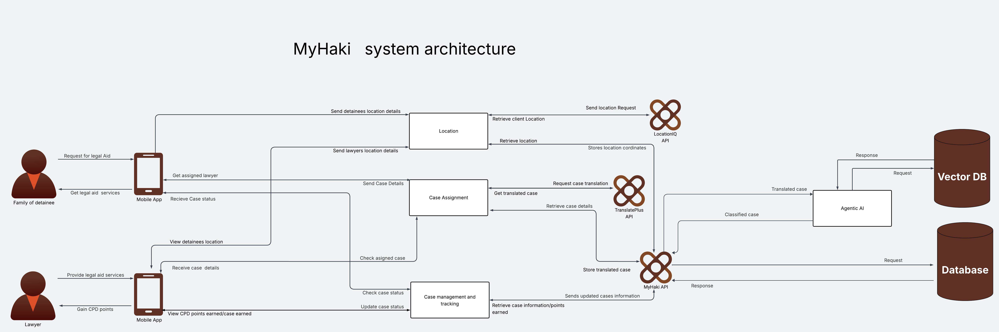
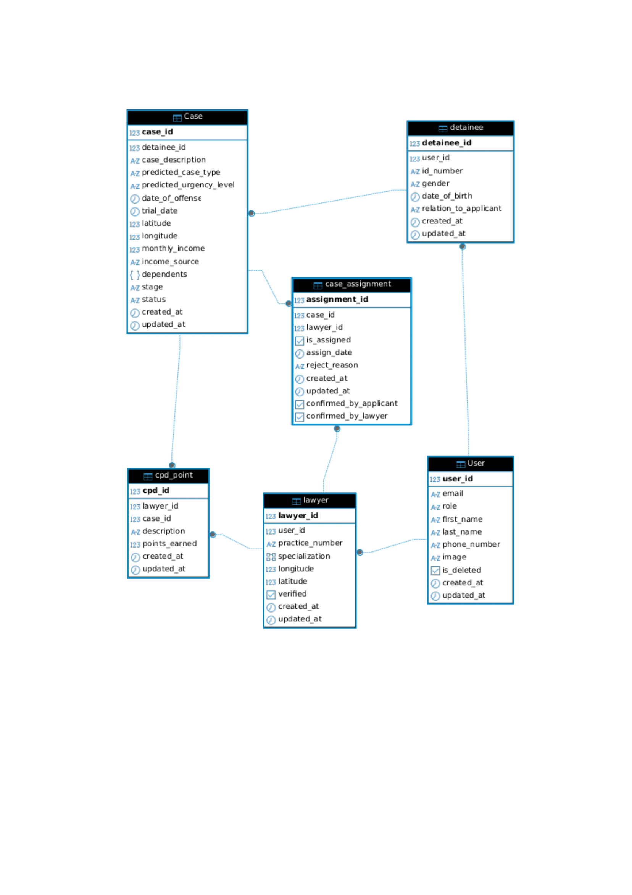

# Developer Docs

Comprehensive documentation for developers building, testing, and deploying the MyHaki platform.  
Learn about architecture, workflows, integrations, and best practices for reliable legal tech.

---

## <span style="font-weight: 600; color: #A87352;">System Architecture</span>



- **Frontend:** Next.js + Tailwind CSS (LSK dashboard, responsive informational website)
- **Mobile:** Android app (MVVM, Jetpack Compose, Koin DI, Retrofit)
- **Backend:** Django REST Framework (Python), internal REST APIs
- **Database:** PostgreSQL with pgvector for AI embeddings
- **Integrations:** 
  - TranslatePlus (form translation to English for AI)
  - LocationIQ (police station geocoding)
  - Agentic AI (Python + Google ADK/Gemini for case classification/prioritization)
  - Celery + Redis (automated case assignment)
- **Testing:** Unit & integration tests (Postman, pytest, JUnit, Compose Test)
- **CI/CD:** GitHub Actions automates tests and deployment (Heroku for API, Vercel for dashboard/web, Google Cloud for FastAPI agent)
- **Branding:** All UI follows MyHaki brand guidelines (see [Brand Guideline](images/brand-guideline.png))

---

## <span style="font-weight: 600; color: #A87352;">Database Schema</span>

Designed for maintainability, access control, and performance using PostgreSQL  
- Core tables: users, lawyers, detainees, cases, assignments, CPD points, vector embeddings (pgvector)



---

## <span style="font-weight: 600; color: #A87352;">.env Usage & Secrets Management</span>

- Sensitive values (API keys, secrets) are stored in `.env` files and never committed to source control.
- Use environment variables for config overrides (dev, staging, production).
- Django loads `.env` via [`python-dotenv`](https://github.com/theskumar/python-dotenv).
- Next.js uses `process.env.VAR_NAME`.
- FastAPI agent uses Google Cloud Secret Manager or `.env`.

---

## <span style="font-weight: 600; color: #A87352;">Automated Testing</span>

- **Backend:** Unit and integration tests for models, views, APIs using `pytest`, `unittest`, and Postman for endpoint validation.
- **Frontend:** Component and API tests using Jest and React Testing Library.
- **Android:** Unit tests (JUnit, MockK), UI tests (Compose Test).
- **Test coverage:** All codebases report coverage in CI.
- **Commands:**
  ```bash
  # Backend
  python manage.py test
  pytest --cov=backend

  # Frontend
  npm test
  npm run coverage

  # Android
  ./gradlew test
  ./gradlew connectedAndroidTest
  ```

---

## <span style="font-weight: 600; color: #A87352;">API Documentation</span>

- **Swagger UI:** Available at `/swagger/` (Heroku backend)
- **Postman:** API flows and contract testing

---

## <span style="font-weight: 600; color: #A87352;">Coding Standards & Quality</span>

- **Linting:** `eslint`/`prettier` (frontend), `flake8`/`black` (backend), `ktlint` (Android)
- **Formatting:** Enforced via CI
- **Type Checking:** TypeScript (`tsc`), Python (`mypy`)
- **Style Guides:** 
  - Next.js best practices
  - Django REST conventions
  - Android Kotlin style guide

---

## <span style="font-weight: 600; color: #A87352;">Branching & PR Workflow</span>

- Feature branches: `feature/xxx`
- Bugfix branches: `bugfix/xxx`
- PR reviews required for all merges to `main`
- Descriptive PR titles, linked issues (`Fixes #issue_num`)
- Checklist: All tests pass, lint passes

---

## <span style="font-weight: 600; color: #A87352;">Directory Structure</span>

- `frontend/` — Next.js dashboard and informational website
- `backend/` — Django REST API
- `android/` — Android app (Compose, MVVM, Koin)
- `agent/` — FastAPI microservice (Agentic AI, Google ADK/Gemini)
- `docs/` — Documentation, brand guidelines
- `tests/` — All tests and testing utilities

---

## <span style="font-weight: 600; color: #A87352;">Running Locally</span>

1. Clone repository  
   ```bash
   git clone https://github.com/your-org/your-repo.git
   cd your-repo
   ```
2. Set up `.env` for each service (see example files)
3. Install dependencies and migrate DB:
   - Backend:
     ```bash
     pip install -r backend/requirements.txt
     python manage.py migrate
     ```
   - Frontend:
     ```bash
     npm install
     ```
   - Android:
     Open in Android Studio, sync Gradle
   - Agent:
     ```bash
     pip install -r agent/requirements.txt
     ```
4. Start services:
   - Backend:
     ```bash
     python manage.py runserver
     ```
   - Frontend:
     ```bash
     npm run dev
     ```
   - Agent:
     ```bash
     uvicorn agent.main:app --reload
     ```
5. Run tests:
   - Backend:
     ```bash
     python manage.py test
     ```
   - Frontend:
     ```bash
     npm test
     ```
   - Android:
     ./gradlew test
   - Agent:
     pytest agent/tests/

---

## <span style="font-weight: 600; color: #A87352;">Deployment</span>

- **Backend:** Deploys to Heroku via GitHub Actions
- **Frontend:** Vercel auto-deploy from `main`
- **Agentic AI:** Dockerized FastAPI agent deploys to Google Cloud (Cloud Run)
- **Production env vars:** Managed in Heroku, Vercel, and Google Cloud dashboards

---

## <span style="font-weight: 600; color: #A87352;">Monitoring & Logging</span>

- **Backend:** Heroku logs via dashboard
- **Frontend:** Vercel logs via dashboard
- **Agent:** Google Cloud Monitoring

---

## <span style="font-weight: 600; color: #A87352;">Integrations Reference</span>

- **TranslatePlus:** API for language translation (Kiswahili to English)
- **LocationIQ:** API for geocoding police station names to latitude/longitude
- **Agentic AI:** Python microservice using Google ADK/Gemini for case classification and prioritization
- **Celery + Redis:** Automated case assignment based on proximity and lawyer expertise

---

## <span style="font-weight: 600; color: #A87352;">Data, RAG, and AI Modeling Notes</span>

- Used legal datasets (court reports, penal codes, hearing records) from JSON, CSV, PDF for model training
- Data chunking with LangChain’s RecursiveCharacterTextSplitter for semantic retrieval
- Embedding storage migrated from ChromaDB to pgvector for efficiency
- AI model selection: Legal-BERT for embeddings after evaluating DistilBERT, CaseLaw-BERT
- RAG system in development for improved search/semantic matching

---

## <span style="font-weight: 600; color: #A87352;">Additional Utilities & Scripts</span>

- **Database reset:**  
  ```bash
  python manage.py flush
  ```
- **Create superuser:**  
  ```bash
  python manage.py createsuperuser
  ```
- **Frontend build:**  
  ```bash
  npm run build
  ```
- **Agent build (Docker):**
  ```bash
  docker build -t myhaki-agent ./agent
  docker run -p 8000:8000 myhaki-agent
  ```

---

For brand assets, see:  
- [Brand Guideline](images/brand-guideline.png)

For technical help, contact:  
- Platform Engineering Team (see README for contact info)

---