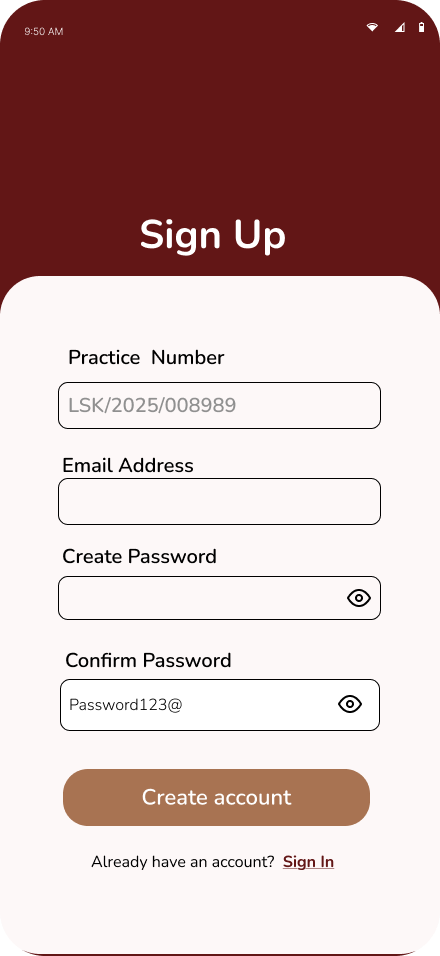
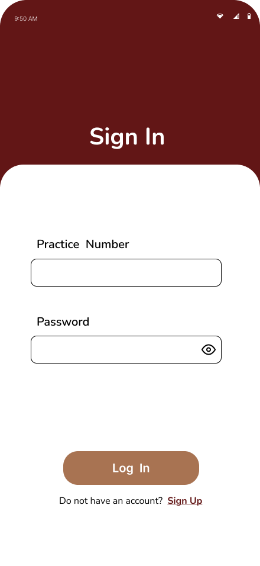
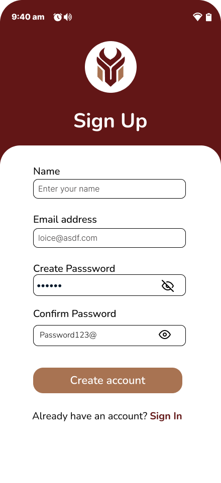
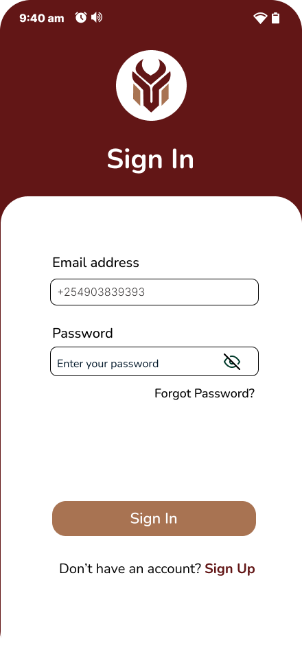
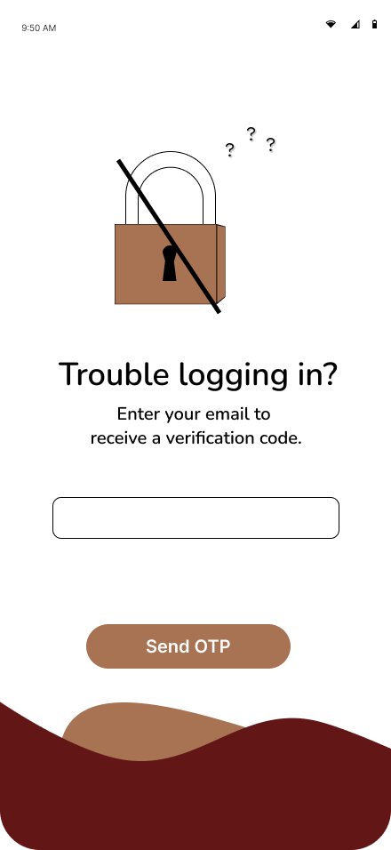
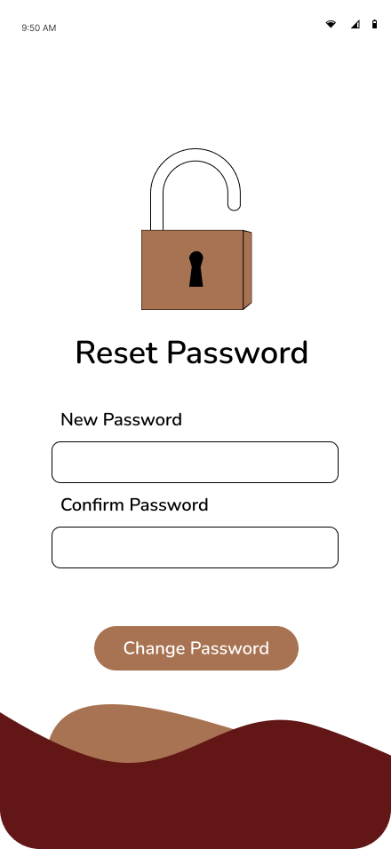

# Getting Started

Welcome to **MyHaki**! This guide walks you through onboarding, authentication, and password management for Applicants (Detainees/Families), Lawyers, and LSK Admins—with real API snippets and backend code.

---

## <h2>1. User Onboarding Flows</h2>

#### <h4>A. Lawyer Onboarding (Android App)</h4>
- **Fields:** Practice Number, First Name, Last Name, Email Address, Password

**API Endpoint:**  
<pre class="api-dark">POST /register-lawyer/</pre>

**Sample Request (from Swagger):**
<pre class="api-dark">
{
  "practice_number": "LSK/2025/008989",
  "first_name": "Loice",
  "last_name": "Nekesa",
  "email": "loice.lawyer@example.com",
  "password": "Password123@"
}
</pre>

**Sample Response:**
<pre class="api-dark">
{
  "practice_number": "LSK/2025/008989",
  "first_name": "Loice",
  "last_name": "Nekesa",
  "email": "loice.lawyer@example.com",
  "verified": true
}
</pre>

**Backend Logic (DRF):**
```python
class RegisterLawyerView(APIView):
    def post(self, request):
        serializer = LawyerProfileSerializer(data=request.data)
        if serializer.is_valid():
            serializer.save()
            return Response(serializer.data, status=201)
        return Response(serializer.errors, status=400)
```




---

### <span style="color:#A87352;">B. Applicant/Detainee Onboarding (Android App)</span>
- **Fields:** First Name, Last Name, Email, Password, Role

**API Endpoint:**  
<pre class="api-dark">POST /signup/</pre>

**Sample Request (from Swagger):**
<pre class="api-dark">
{
  "first_name": "Fiona",
  "last_name": "Wesonga",
  "email": "fiona.applicant@example.com",
  "password": "Password123@",
  "role": "applicant"
}
</pre>

**Sample Response:**
<pre class="api-dark">
{
  "id": 11,
  "first_name": "Fiona",
  "last_name": "Wesonga",
  "email": "fiona.applicant@example.com",
  "role": "applicant",
  "created_at": "2025-10-01T20:41:01Z"
}
</pre>

**Backend Logic:**
```python
class ApplicantSignUpView(APIView):
    def post(self, request):
        serializer = ApplicantSignUpSerializer(data=request.data)
        if serializer.is_valid():
            serializer.save()
            return Response(serializer.data, status=201)
        return Response(serializer.errors, status=400)
```




---

### <span style="color:#A87352;">C. LSK Admin Onboarding (Web Dashboard)</span>
- **Fields:** Email, Password

**API Endpoint:**  
<pre class="api-dark">POST /login/</pre>

**Sample Request (from Swagger):**
<pre class="api-dark">
{
  "email": "admin.lsk@example.com",
  "password": "Password123@"
}
</pre>

**Sample Response:**
<pre class="api-dark">
{
  "token": "jwt-token-string"
}
</pre>

**Backend Logic:**
```python
class LoginView(APIView):
    def post(self, request):
        email = request.data.get('email')
        password = request.data.get('password')
        user = authenticate(username=email, password=password)
        if user:
            refresh = RefreshToken.for_user(user)
            return Response({'token': str(refresh.access_token)})
        return Response({'error': 'Invalid credentials.'}, status=401)
```


---

## <span style="font-weight: 600; color: #A87352;">2. Authentication & Security</span>

**Login API (All Users):**  
<pre class="api-dark">POST /login/</pre>

**Sample Request:**  
<pre class="api-dark">
{
  "email": "user@example.com",
  "password": "Password123@"
}
</pre>

**Sample Response:**  
<pre class="api-dark">
{
  "token": "jwt-token-string"
}
</pre>

---

## <span style="font-weight: 600; color: #A87352;">3. Forgot Password, OTP Verification & Reset Flow (All Users)</span>

**Step 1: Initiate Password Reset**  
<pre class="api-dark">POST /forgotpassword/</pre>
<pre class="api-dark">
{
  "email": "user@example.com"
}
</pre>
_Response:_
<pre class="api-dark">
{
  "message": "Password reset code sent."
}
</pre>

**Step 2: Verify Code**  
<pre class="api-dark">POST /verifycode/</pre>
<pre class="api-dark">
{
  "email": "user@example.com",
  "code": "1234"
}
</pre>
_Response:_
<pre class="api-dark">
{
  "detail": "Code verified. Proceed to reset password."
}
</pre>

**Step 3: Reset Password**  
<pre class="api-dark">POST /resetpassword/</pre>
<pre class="api-dark">
{
  "email": "user@example.com",
  "password": "NewSecurePassword@"
}
</pre>
_Response:_
<pre class="api-dark">
{
  "detail": "Password reset successful."
}
</pre>

**Backend Logic for OTP/Reset:**
```python
class ForgotPasswordView(APIView):
    def post(self, request):
        email = request.data.get('email')
        # Generate and send OTP, cache for validation
        ...

class VerifyCodeView(APIView):
    def post(self, request):
        # Validate code from cache/session
        ...

class ResetPasswordView(APIView):
    def post(self, request):
        email = request.data.get('email')
        password = request.data.get('password')
        user = User.objects.filter(email=email).first()
        if not user:
            return Response({"detail": "User not found."}, status=400)
        user.set_password(password)
        user.save()
        cache.delete(f'reset_code_{email}')
        return Response({"detail": "Password reset successful."}, status=201)
```





---

## <span style="font-weight: 600; color: #A87352;">4. First Steps After Login</span>

- **Applicants:**  
  - Submit new case applications, upload documents, and track case status.
  - Receive notifications for every case update.

- **Lawyers:**  
  - View assigned cases, update progress, submit reports, and monitor CPD points.
  - Real-time notifications for new assignments and deadlines.

- **LSK Admins:**  
  - Monitor overall case flow, assign lawyers, and generate compliance reports.

---

## <span style="font-weight: 600; color: #A87352;">5. Security & Support</span>

- All authentication flows use secure HTTPS and encrypted storage.
- For help, access support via the app or dashboard.

---

<style>
.api-block {
  background: #621616;
  border-radius: 10px;
  padding: 18px 18px 10px 18px;
  margin: 18px 0 24px 0;
  overflow-x: auto;
  font-size: 1.09em;
  font-family: 'Fira Mono', 'Consolas', 'monospace';
}
.api-dark {
  background: #621616 !important;
  color: #fff !important;
  border-radius: 6px;
  padding: 12px 14px 8px 14px;
  margin: 0;
  font-size: 1em;
  font-family: 'Fira Mono', 'Consolas', 'monospace';
}
</style>